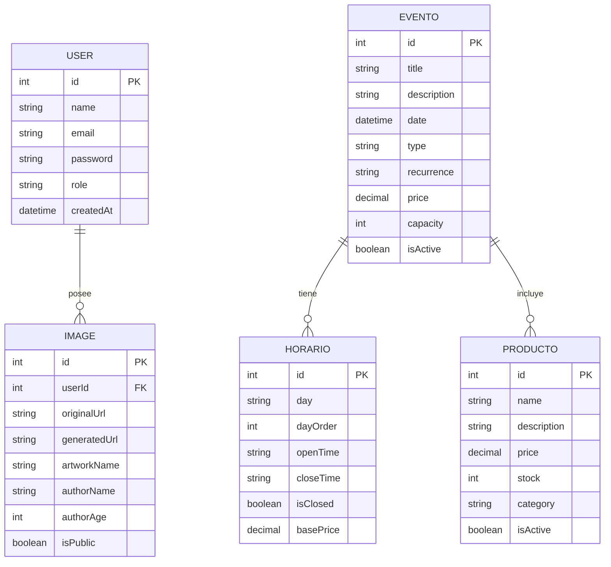

# Modelo de Datos

## Descripción General

La persistencia de datos del sistema se implementa mediante PostgreSQL utilizando Prisma ORM como capa de acceso a datos.

La base de datos almacena información relacionada con usuarios, eventos, horarios, productos e imágenes generadas mediante inteligencia artificial.

---

## Diagrama Entidad Relación


## Diagrama Entidad Relación Visual


---

## Entidad User

Representa los usuarios registrados en la plataforma.

### Campos

| Campo     | Descripción                   |
| --------- | ----------------------------- |
| id        | Identificador único           |
| name      | Nombre del usuario            |
| email     | Correo electrónico            |
| password  | Contraseña cifrada con bcrypt |
| role      | USER o ADMIN                  |
| createdAt | Fecha de creación             |

---

## Entidad Evento

Representa actividades culturales y exposiciones.

### Campos

| Campo       | Descripción           |
| ----------- | --------------------- |
| title       | Nombre del evento     |
| description | Información detallada |
| date        | Fecha del evento      |
| type        | Tipo de actividad     |
| recurrence  | Frecuencia            |
| price       | Precio de entrada     |
| capacity    | Cupo máximo           |
| isActive    | Estado del evento     |

---

## Entidad Horario

Define los horarios de atención del museo.

### Campos

| Campo     | Descripción            |
| --------- | ---------------------- |
| day       | Día de la semana       |
| dayOrder  | Orden de visualización |
| openTime  | Hora apertura          |
| closeTime | Hora cierre            |
| isClosed  | Día cerrado            |
| basePrice | Tarifa base            |

---

## Entidad Producto

Representa los artículos disponibles en la tienda institucional.

### Campos

| Campo       | Descripción    |
| ----------- | -------------- |
| name        | Nombre         |
| description | Descripción    |
| price       | Precio         |
| stock       | Inventario     |
| category    | Categoría      |
| isActive    | Disponibilidad |

---

## Entidad Image

Almacena imágenes originales y generadas por IA.

### Campos

| Campo        | Descripción       |
| ------------ | ----------------- |
| originalUrl  | Imagen subida     |
| generatedUrl | Imagen generada   |
| artworkName  | Nombre de la obra |
| authorName   | Autor             |
| authorAge    | Edad              |
| isPublic     | Visibilidad       |

---

## Relación Principal

Un usuario puede poseer múltiples imágenes generadas.

```text
User 1 ---- N Image
```
