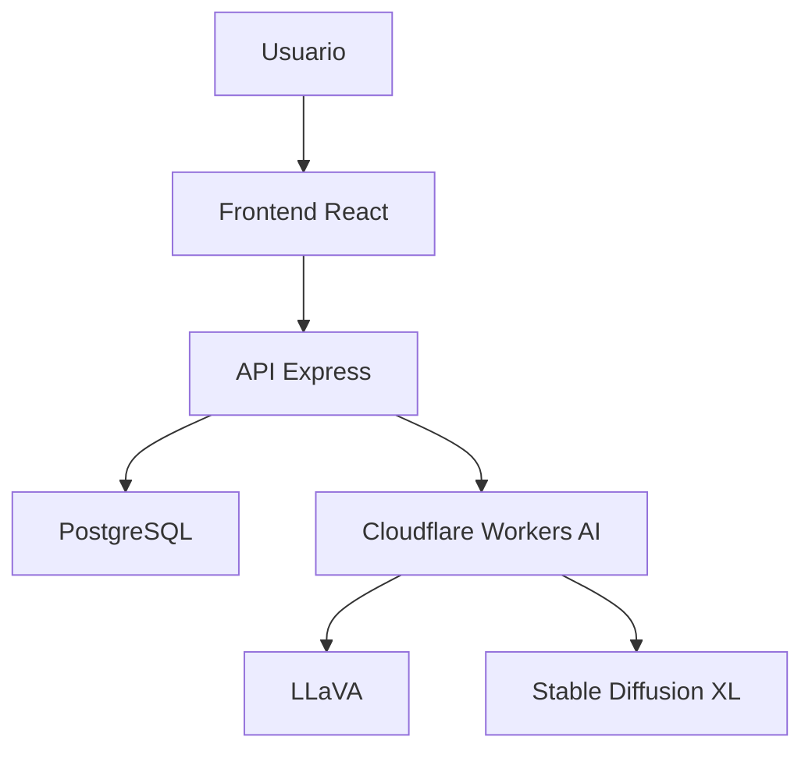

# Despliegue e Infraestructura

## Objetivo

Garantizar la disponibilidad, escalabilidad y mantenimiento de la plataforma MAMB mediante una arquitectura moderna basada en servicios cloud.

---

## Arquitectura de Despliegue



---

## Frontend

### Tecnología

* React
* Vite
* Tailwind CSS

### Despliegue

Se recomienda desplegar mediante:

* Vercel
* Netlify

### Comando de producción

```bash
npm run build
```

Genera la carpeta:

```text
dist/
```

---

## Backend

### Tecnología

* Node.js
* Express

### Despliegue

Puede ejecutarse en:

* Railway
* Render
* VPS Linux
* Docker

### Inicio

```bash
npm run dev
```

---

## Base de Datos

### Motor

PostgreSQL

### Migraciones

```bash
npx prisma migrate dev
```

### Administración

```bash
npm run prisma:studio
```

Acceso:

```text
http://localhost:5555
```

---

## Variables de Entorno

### Backend

```env
DATABASE_URL=
JWT_SECRET=
PORT=
HF_TOKEN=
CF_ACCOUNT_ID=
CF_TOKEN=
```

---

## Inteligencia Artificial

La plataforma utiliza Cloudflare Workers AI.

### Modelos utilizados

#### LLaVA

Analiza el dibujo enviado por el usuario y produce una descripción textual.

#### Stable Diffusion XL

Genera una reinterpretación artística basada en la descripción generada.

---

## Seguridad

* JWT para autenticación.
* bcrypt para hash de contraseñas.
* Middleware de autorización.
* Restricción de rutas administrativas.
